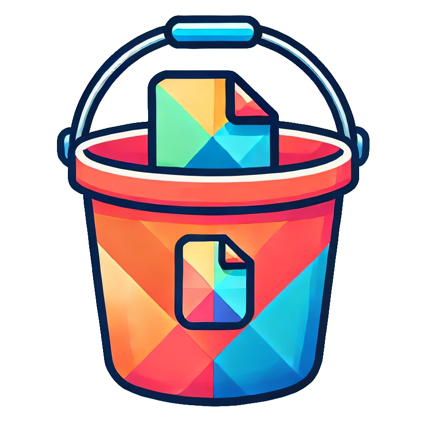

<div align="center">

<br/>


# Bucketline
[](https://www.npmjs.com/package/bucketline) [](https://www.npmjs.com/package/bucketline)

<h4>
Bucket Storage integration for your Visual Regression CI. Supports Playwright & Storybook and GitHub & GitLab.

<br/>

Fully free and open-source alternative to Chromatic.
</h4>


<br/>

## 🏗️ - WIP! This is not usable yet! - 👷

</div>

# ☁️ Cloud Setup


### 1) Setup the File Storage with [Xata](https://xata.io)
[Xata](https://xata.io) is a Cloud service which Free Tier includes a generous **2GB file storage** [on steroids](https://xata.io/docs/sdk/file-attachments).

  1) Sign-in to [Xata](https://xata.io)
  2) Go through the onboarding process until they provide the API keys and copy them. You can skip the remaining steps.
  3) Set these ENVs in your CI settings:

  ```
  BUCKETLINE_DB_API_KEY = <XATA_API_KEY>
  BUCKETLINE_DB_URL = <DATABASE_URL>
  ```

### 2) Setup the Frontend with NextJS

  1) Sign-in to https://vercel.com/login
  2) Click to add a new project
  3) Click on the link `Import Third-Party Git Repository` and enter

## 🤖 Development

**For local development of this package**, You need `bun`. Then:

```bash
bun start
```
