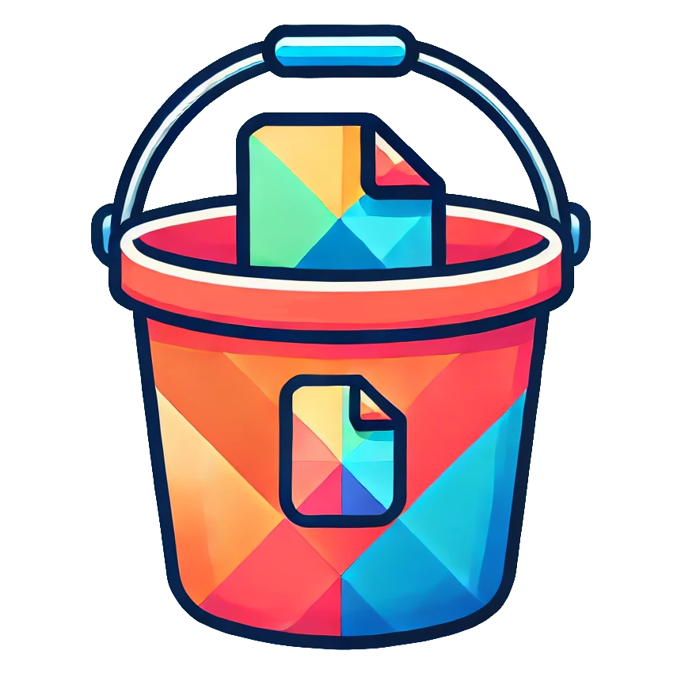

<div align="center">

<br/>


# bucketline
[](https://www.npmjs.com/package/bucketline) [](https://www.npmjs.com/package/bucketline)


<h4>

Integrate cloud bucket storage into your Visual Regression pipeline

</h4>


<br/>

</div>

## 💿 Installation

## ℹ️ Info


## 📰 [Changelog](CHANGELOG.md)


## 🤖 Development

**For local development of this package**, You need `bun`. Then:

```bash
bun start
```
